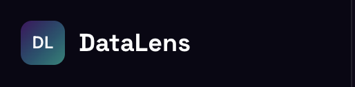
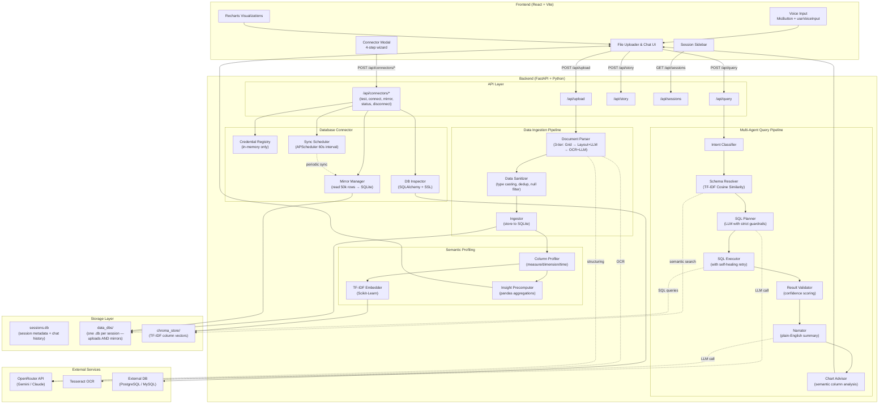
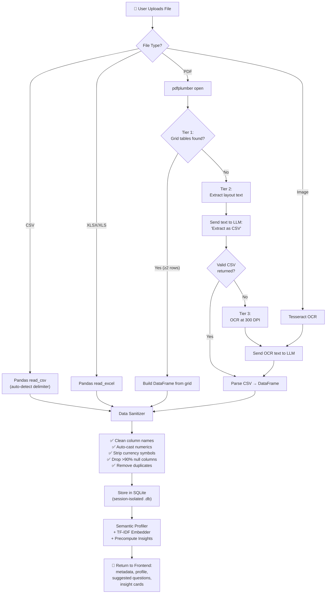
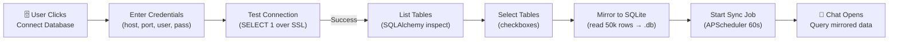
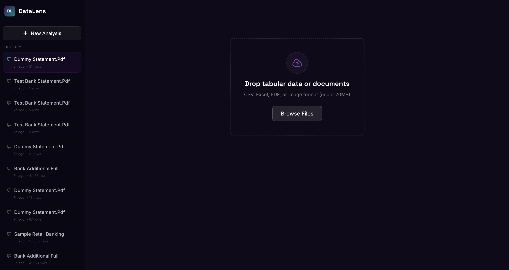
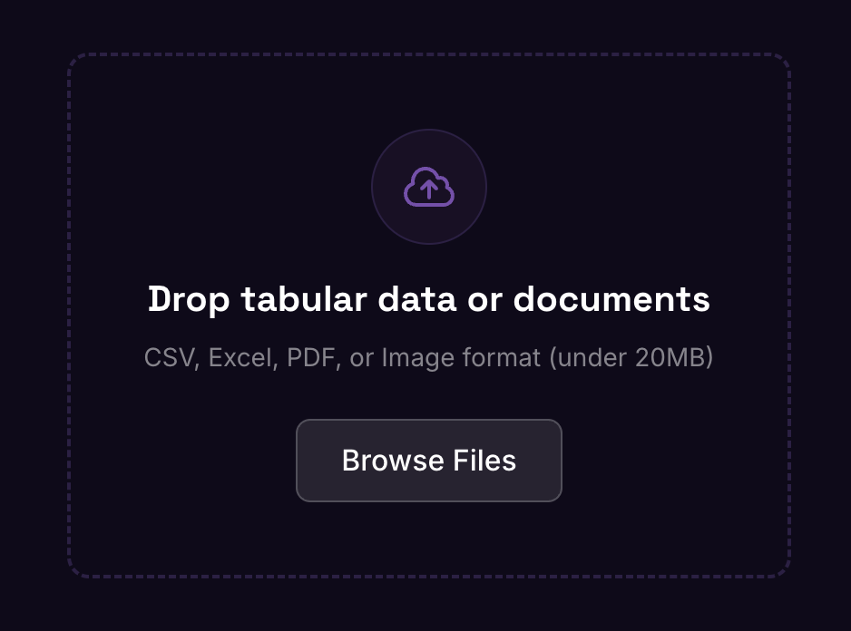
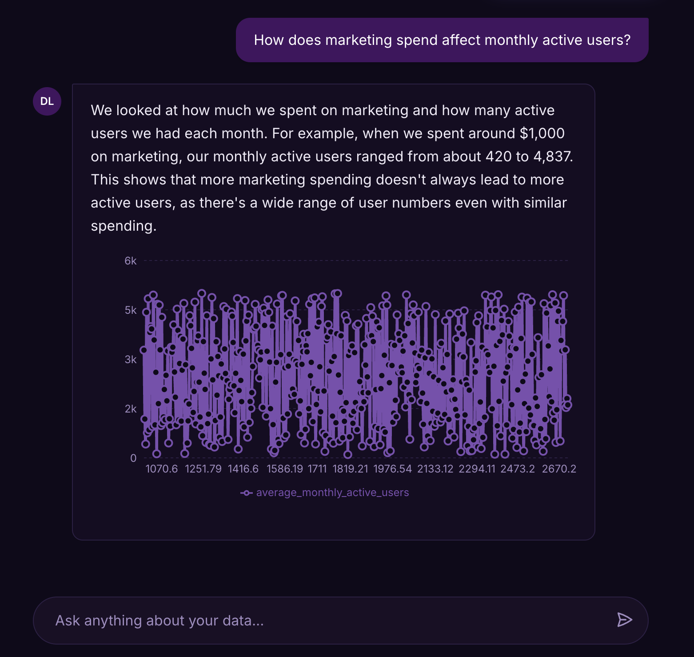
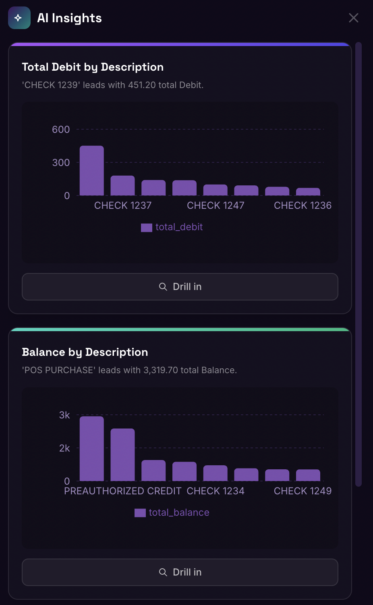

<div align="center">

# 🔍 NatWest CodeForPurpose — Talk To Data Solution (DataLens)

**🚀 Live Demo:** [https://code-for-purpose-talk-to-data.vercel.app](https://code-for-purpose-talk-to-data.vercel.app)

**Transform raw documents _and live databases_ into interactive insights through natural language — with your voice or keyboard.**

<!-- ═══════════════════════════════════════════════════════════════════════
     📸 HERO SCREENSHOT — Replace the placeholder below with your screenshot
     ═══════════════════════════════════════════════════════════════════════ -->



</div>

---

## 📖 Overview

**DataLens** is a full-stack, AI-powered analytics platform that lets users upload raw data files — CSVs, Excel spreadsheets, PDFs, and images of financial documents — **or connect directly to live PostgreSQL and MySQL databases** — and instantly query them using plain English or voice. It eliminates the need for manual data wrangling, SQL expertise, or BI tool configuration by combining a multi-agent LLM pipeline with automated data profiling, intelligent chart generation, and real-time database mirroring.

**The problem it solves:** Extracting insights from unstructured documents (e.g., scanned bank statements, invoices) or siloed production databases traditionally requires hours of manual data entry, regex heuristics, SQL scripting, and ETL pipeline setup. DataLens automates the entire pipeline — from OCR extraction _or_ live database connection, to structured storage, to conversational querying — in seconds.

**Intended users:** Business analysts, financial controllers, operations managers, data engineers, startup founders, and anyone who needs quick data-driven answers without writing code.

---

## ✨ Features

### Core Analytics Engine

- **Multi-format file ingestion** — Upload `.csv`, `.xlsx`, `.xls`, `.pdf`, `.png`, `.jpg`, and `.jpeg` files through the drag-and-drop UI.
- **Intelligent PDF/Image parsing with 3-tier fallback strategy:**
  - **Tier 1:** Native table grid extraction via `pdfplumber` for digitally-created PDFs.
  - **Tier 2:** Layout-preserving text extraction → LLM-powered structuring for non-grid documents.
  - **Tier 3:** High-resolution OCR (300 DPI) via `pytesseract` → LLM-powered structuring for scanned/photographed documents.
- **LLM-powered data structuring** — Raw text from PDFs/images is sent to an LLM (Gemini/Claude via OpenRouter) which returns clean, typed CSV with meaningful column headers (Date, Description, Debit, Credit, Balance, etc.).
- **Automated data sanitization pipeline** — Strips currency symbols, auto-casts numeric types, removes OCR artifacts, drops columns with >90% null values, removes duplicate rows, and filters out monotonically increasing ID columns.
- **Semantic column profiling** — Each column is automatically classified as `measure`, `dimension`, or `time` using statistical heuristics. An LLM generates plain-English descriptions for every column.
- **TF-IDF semantic schema search** — Column descriptions are vectorized using TF-IDF and matched via Cosine Similarity (a lightweight alternative to heavyweight embedding models that enables deployment on 512MB RAM free-tier hosting).
- **Multi-agent conversational SQL pipeline** — User questions are processed through a 7-stage directed acyclic graph (DAG): Intent Classification → Schema Resolution → SQL Planning → Sandboxed Execution → Validation → Narration → Chart Recommendation.
- **Self-healing SQL execution** — If the generated SQL fails, the executor automatically sends the error back to the LLM for correction, retrying up to 2 times.
- **Context-aware chart recommendation** — The Chart Advisor semantically analyzes column names and data shapes to choose the most appropriate visualization: line charts for time-series, pie charts for ≤6 categories, bar charts for comparisons, and tables for raw data.
- **Precomputed dashboard insights** — Instant KPI cards are generated the moment data is uploaded: total by category, distribution breakdowns, averages, trend lines, and top-N tables.
- **AI-generated suggested questions** — After upload, the LLM generates 5 contextual starter questions based on the actual column profiles.
- **Session management with sidebar** — Multiple analysis sessions can be created, switched between, and revisited. Chat history is persisted per session.
- **Confidence scoring** — Every AI response includes a confidence level (High / Medium / Low).
- **Rate limiting** — Backend API is protected with configurable per-minute rate limits via `slowapi`.

### 🎙️ Voice Input

- **Browser-native speech-to-text** — Click the microphone button in the chat input to speak your question instead of typing.
- **Real-time transcript sync** — Spoken words appear live in the input field as you speak, and can be edited before sending.
- **Pulsing visual feedback** — A red pulsing ring animation indicates active listening status.
- **Graceful degradation** — The mic button auto-hides on unsupported browsers and greys out if microphone permission is denied.
- **UK English locale** — Uses `en-GB` recognition optimized for NatWest's UK context.

### 🗄️ Live Database Connector

- **Direct PostgreSQL & MySQL connections** — Connect to any external database (Supabase, AWS RDS, PlanetScale, Neon, self-hosted) through a 4-step wizard modal.
- **SSL-by-default** — All connections use `sslmode=require` (PostgreSQL) or `ssl.create_default_context()` (MySQL), supporting cloud-hosted databases out of the box.
- **Mirror Mode architecture** — Selected tables are copied into a local session-isolated SQLite mirror (up to 50,000 rows per table), enabling the same AI query pipeline used for file uploads — zero changes to the existing agent DAG.
- **Background auto-sync** — An APScheduler background job re-syncs mirrored tables every 60 seconds, comparing source row counts and refreshing when changes are detected.
- **In-memory credential security** — Database credentials are stored only in process memory. They are never written to disk, never logged, and are purged on server restart.
- **Prominent Connect Database UI** — A clearly visible "Connect External Database" button sits below the file uploader on the landing page. After connecting, the chat UI opens instantly with a live green sync badge.
- **One-click disconnect** — Cancels background sync, deletes the mirror file, and purges credentials from memory.

---

## 🏗️ System Architecture

### High-Level Architecture



### Document Ingestion Pipeline (Detail)



### Multi-Agent Query Pipeline (DAG)

```mermaid
flowchart LR
    A["💬 User Question<br/>(typed or spoken)"] --> B["Intent Classifier<br/><i>aggregation, comparison,<br/>breakdown, trend,<br/>anomaly, follow_up, general</i>"]
    B --> C["Schema Resolver<br/><i>TF-IDF Cosine Similarity<br/>for top-5 relevant columns</i>"]
    C --> D["SQL Planner<br/><i>LLM generates SQL + chart type<br/>with strict guardrails</i>"]
    D --> E["Executor<br/><i>Run SQL on sandboxed SQLite<br/>Self-heal on error (2 retries)</i>"]
    E --> F["Validator<br/><i>Check empty results,<br/>truncate >500 rows,<br/>assign confidence</i>"]
    F --> G["Narrator<br/><i>LLM writes plain-English<br/>summary of results</i>"]
    G --> H["Chart Advisor<br/><i>Semantic column analysis<br/>→ bar/line/pie/table/none</i>"]
    H --> I["📊 Response to Frontend"]
```



### Database Connector Flow (NEW)



---

## 💻 Tech Stack

| Layer | Technology | Purpose |
|-------|-----------|---------|
| **Frontend Framework** | React 18 + TypeScript | Component-based UI with type safety |
| **Build Tool** | Vite 5 | Fast dev server with HMR |
| **Styling** | Tailwind CSS 3 | Utility-first responsive design with custom NatWest theme |
| **Charting** | Recharts 2 | Composable Bar, Line, Pie, and Table charts |
| **Voice Input** | react-speech-recognition | Browser-native Web Speech API integration |
| **HTTP Client** | Axios | API communication with upload progress tracking |
| **Backend Framework** | FastAPI 0.111 | Async Python API with auto-generated OpenAPI docs |
| **ASGI Server** | Uvicorn 0.29 | Production-grade async server |
| **Data Processing** | Pandas 2.2 | DataFrame manipulation, type casting, aggregation |
| **SQL ORM** | SQLAlchemy 2.0 | Database engine creation, schema inspection, SSL connections |
| **Database** | SQLite | Session-isolated data storage (one `.db` per upload or mirror) |
| **External DB Support** | psycopg2 + PyMySQL | PostgreSQL and MySQL driver support with SSL |
| **Background Jobs** | APScheduler 3.10 | Periodic database sync scheduler |
| **PDF Parsing** | pdfplumber 0.11 | Native table grid extraction and layout-preserving text |
| **OCR Engine** | pytesseract 0.3 + Tesseract 5 | Optical character recognition for scanned documents |
| **LLM Orchestration** | LangChain 0.2 | Prompt templates, chain composition, LLM wrappers |
| **LLM Provider** | OpenRouter → Gemini / Claude | Natural language understanding, SQL generation, narration |
| **Semantic Search** | Scikit-Learn 1.4 (TF-IDF + Cosine Similarity) | Lightweight column matching — no GPU or heavy model needed |
| **Validation** | Pydantic 2.7 | Request/response schema validation |
| **Rate Limiting** | slowapi 0.1 | Per-IP rate limiting on API endpoints |
| **Deployment** | Render (backend) + Vercel (frontend) | Production hosting with auto-deploy from GitHub |

---

## 🚀 Installation & Run Instructions

### Prerequisites

| Tool | Version | Installation |
|------|---------|-------------|
| **Python** | 3.9+ | [python.org](https://www.python.org/downloads/) |
| **Node.js** | 18+ | [nodejs.org](https://nodejs.org/) |
| **Tesseract OCR** | 5.x | `brew install tesseract` (macOS) or `sudo apt install tesseract-ocr` (Ubuntu) |
| **OpenRouter API Key** | — | [openrouter.ai](https://openrouter.ai/) (free tier available) |

### Step 1: Clone the Repository

```bash
git clone https://github.com/mrinank03/CodeForPurpose_Talk_To_Data.git
cd CodeForPurpose_Talk_To_Data
```

### Step 2: Backend Setup

```bash
cd backend

# Create and activate virtual environment
python3 -m venv venv
source venv/bin/activate        # macOS/Linux
# .\venv\Scripts\activate       # Windows

# Install Python dependencies
pip install -r requirements.txt

# Configure environment variables
cp .env.example .env
```

Open `backend/.env` and set your API key:

```env
# Required — get your key from https://openrouter.ai/
OPENROUTER_API_KEY=sk-or-v1-your-key-here
OPENROUTER_MODEL=google/gemini-2.5-flash

# Database paths (defaults work out of the box)
SESSIONS_DB_PATH=./sessions.db
DATA_DB_DIR=./data_dbs/
CHROMA_PATH=./chroma_store/

# Server
ALLOWED_ORIGIN=http://localhost:5173
PORT=8000

# LLM tuning
SQL_LLM_TEMPERATURE=0.1
NARRATOR_LLM_TEMPERATURE=0.3
MAX_RETRY_ATTEMPTS=2
MAX_RESULT_ROWS=500
MAX_UPLOAD_SIZE_MB=20
RATE_LIMIT_PER_MINUTE=30
```

### Step 3: Frontend Setup

Open a **new terminal**:

```bash
cd frontend

# Install Node dependencies
npm install

# Configure environment
cp .env.example .env
```

The frontend `.env` should contain:
```env
VITE_API_URL=http://localhost:8000
```

### Step 4: Launch the Application

**Terminal 1 — Backend:**
```bash
cd backend
source venv/bin/activate
uvicorn src.main:app --reload --port 8000
```

Verify the backend is running:
```bash
curl http://localhost:8000/health
# Expected: {"status":"ok"}
```

**Terminal 2 — Frontend:**
```bash
cd frontend
npm run dev
```

Open your browser at **http://localhost:5173**

### Quick Setup (Alternative)

A convenience script is provided:
```bash
chmod +x scripts/setup.sh
./scripts/setup.sh
```

---

## 🎯 Usage Examples

> [!TIP]
> **Don't have any data handy?**
> We've generated a 500-record high-quality retail banking dataset specifically for testing. You can find it in the [`sample_data/retail_banking_transactions.csv`](./sample_data/retail_banking_transactions.csv) folder. Download it and drop it into the live app to instantly see the AI in action!

### Use Case 1: Upload a CSV and Chat

1. Open DataLens at `http://localhost:5173`.
2. Drag and drop a CSV file (e.g., sales data, transaction log) into the upload zone.
3. The system will automatically profile every column, generate insight cards, and suggest questions.
4. In the chat, type: _"What is the total revenue by region?"_
5. DataLens will generate SQL, execute it, and render a bar chart with a plain-English summary.



### Use Case 2: Upload a PDF Bank Statement

1. Upload a PDF bank statement (even a scanned image within a PDF).
2. The 3-tier parser will detect the best extraction strategy.
3. The LLM structures the raw text into clean columns: Date, Description, Debit, Credit, Balance.
4. Browse the precomputed insight cards or ask: _"What were my top 5 expenses?"_



### Use Case 3: Voice-Powered Querying 🎙️

1. Click the **microphone button** next to the chat input.
2. Speak your question naturally: _"Show me spending by category last month."_
3. Watch your words appear in real-time in the input field.
4. Press **Send** or click the mic again to stop and submit.
5. The AI processes your spoken query just like a typed one — complete with SQL, charts, and narration.

### Use Case 4: Connect a Live Database 🗄️

1. Click **"Connect External Database"** on the landing page (below the file uploader).
2. Choose **PostgreSQL** or **MySQL**, enter your host, port, credentials.
3. Click **Test Connection** — DataLens verifies the connection over SSL.
4. Select which tables to mirror — up to 50,000 rows per table are copied to a local SQLite mirror.
5. The **chat UI opens instantly** — ask questions about your live database in plain English.
6. A background job auto-syncs every 60 seconds, so you always query fresh data.

> [!NOTE]
> **Security:** Credentials are held in-memory only. They are never written to disk, never logged, and are purged when the server restarts. For production use, run behind HTTPS.

### Use Case 5: Conversational Drill-Down

1. Ask: _"Show spending by category"_ → Get a pie chart.
2. Follow up: _"Which category has the highest average amount?"_ → Get a bar chart.
3. Follow up: _"What is the trend of expenses over time?"_ → Get a line chart.

Each response includes the generated SQL, a confidence score, and a context-aware chart.



### Use Case 6: AI-Generated Insight Cards

Click **"Generate AI Insights"** to produce precomputed dashboard cards based purely on the data — no prompt required.



### Example API Calls

**Upload a file:**
```bash
curl -X POST http://localhost:8000/api/upload \
  -F "file=@/path/to/bank_statement.pdf;type=application/pdf"
```

**Query your data:**
```bash
curl -X POST http://localhost:8000/api/query \
  -H "Content-Type: application/json" \
  -d '{"session_id": "YOUR_SESSION_ID", "question": "What is the total debit amount?"}'
```

**Test a database connection:**
```bash
curl -X POST http://localhost:8000/api/connectors/test \
  -H "Content-Type: application/json" \
  -d '{"db_type": "postgresql", "host": "db.example.com", "port": 5432, "database": "analytics", "username": "user", "password": "pass"}'
```

**Connect and list tables:**
```bash
curl -X POST http://localhost:8000/api/connectors/connect \
  -H "Content-Type: application/json" \
  -d '{"session_id": "SESSION_ID", "connection_name": "Production DB", "db_type": "postgresql", "host": "db.example.com", "port": 5432, "database": "analytics", "username": "user", "password": "pass"}'
```

**Mirror selected tables:**
```bash
curl -X POST http://localhost:8000/api/connectors/mirror \
  -H "Content-Type: application/json" \
  -d '{"session_id": "SESSION_ID", "tables": ["transactions", "customers"]}'
```

**Sample query response:**
```json
{
  "answer": "The total debit amount across all transactions is £14,250.75.",
  "sql": "SELECT SUM(debit) AS total_debit FROM data_abc123",
  "chart_type": "none",
  "chart_data": [{"total_debit": 14250.75}],
  "confidence": "High",
  "columns_used": ["debit"],
  "intent": "aggregation"
}
```

---

## 📂 Folder Structure

```
DATALENS/
├── README.md                          # This file
├── .gitignore
├── render.yaml                        # Render.com deployment blueprint
├── runtime.txt                        # Python version for Render (3.11.9)
├── generate_synthetic.py              # Script to generate sample banking data
│
├── backend/
│   ├── .env.example                   # Environment variable template (no secrets)
│   ├── requirements.txt               # Python dependencies (pip install -r)
│   ├── render_build.sh                # Render build script
│   │
│   ├── src/
│   │   ├── main.py                    # FastAPI app entrypoint, CORS, rate limiting
│   │   │
│   │   ├── api/
│   │   │   ├── models.py             # Pydantic request/response schemas
│   │   │   └── routes/
│   │   │       ├── upload.py          # POST /api/upload — file ingestion endpoint
│   │   │       ├── query.py           # POST /api/query — conversational query endpoint
│   │   │       ├── story.py           # POST /api/story — AI insight card generation
│   │   │       ├── sessions.py        # GET /api/sessions — session management
│   │   │       └── connectors.py      # /api/connectors/* — database connector endpoints
│   │   │
│   │   ├── connectors/                # ← NEW: Database connector subsystem
│   │   │   ├── connector_registry.py  # Thread-safe in-memory credential store
│   │   │   ├── db_inspector.py        # SQLAlchemy schema inspection + SSL engine factory
│   │   │   ├── mirror_manager.py      # Copy source tables into session SQLite mirrors
│   │   │   └── sync_scheduler.py      # APScheduler periodic background sync
│   │   │
│   │   ├── data/
│   │   │   ├── ingestor.py            # File parsing orchestrator + SQLite storage
│   │   │   ├── document_parser.py     # 3-tier PDF/image parser (pdfplumber → LLM → OCR)
│   │   │   └── session_store.py       # Session CRUD + message persistence
│   │   │
│   │   ├── agents/
│   │   │   ├── intent_classifier.py   # LLM-based intent detection (7 categories)
│   │   │   ├── schema_resolver.py     # TF-IDF semantic column search
│   │   │   ├── sql_planner.py         # LLM → SQL generation with guardrails
│   │   │   ├── executor.py            # Sandboxed SQL execution with self-healing
│   │   │   ├── validator.py           # Result validation + confidence scoring
│   │   │   └── narrator.py            # LLM → plain-English result narration
│   │   │
│   │   ├── semantic/
│   │   │   ├── profiler.py            # Column type inference + LLM metric dictionary
│   │   │   └── embedder.py            # TF-IDF vectorizer + Cosine Similarity search
│   │   │
│   │   ├── story/
│   │   │   ├── precompute.py          # Pandas-based insight card generation engine
│   │   │   └── analyst_mode.py        # Story mode orchestrator (SQLite → precompute)
│   │   │
│   │   └── utils/
│   │       ├── llm_factory.py         # LLM singleton factory (OpenRouter/Gemini/Claude)
│   │       ├── chart_advisor.py       # Semantic chart type recommendation
│   │       └── confidence.py          # Confidence level enum (High/Medium/Low)
│   │
│   └── tests/
│       ├── test_executor.py           # SQL execution + self-healing retry tests
│       ├── test_profiler.py           # Semantic type inference tests
│       └── test_sql_planner.py        # SQL generation structure + injection guard tests
│
├── frontend/
│   ├── .env.example                   # Frontend environment template
│   ├── package.json                   # Node dependencies
│   ├── vite.config.ts                 # Vite build configuration
│   ├── tailwind.config.js             # Tailwind CSS NatWest theme (custom purple/teal palette)
│   ├── tsconfig.json                  # TypeScript configuration
│   │
│   └── src/
│       ├── App.tsx                    # Root component — layout, state, connector modal
│       ├── main.tsx                   # React DOM entry point
│       ├── index.css                  # Global styles + Tailwind imports
│       │
│       ├── components/
│       │   ├── Upload/
│       │   │   ├── FileUploader.tsx   # Drag-and-drop file upload with progress bar
│       │   │   └── DatasetSummary.tsx # Dataset metadata display after upload
│       │   ├── Chat/
│       │   │   ├── ChatWindow.tsx     # Chat container with suggested questions
│       │   │   ├── ChatInput.tsx      # Message input bar + voice integration
│       │   │   ├── ChatMessage.tsx    # Individual message bubble (user/assistant)
│       │   │   ├── MicButton.tsx      # ← NEW: Microphone toggle with pulsing animation
│       │   │   └── SuggestedQuestions.tsx
│       │   ├── Charts/
│       │   │   ├── ChartRenderer.tsx  # Dynamic chart rendering (bar/line/pie/table)
│       │   │   └── MiniChart.tsx      # Compact chart for insight cards
│       │   ├── Story/
│       │   │   ├── StoryCards.tsx      # Insight card grid container
│       │   │   └── StoryCard.tsx      # Individual insight card with drill-in
│       │   ├── Connectors/            # ← NEW: Database connector UI
│       │   │   ├── ConnectorModal.tsx # 4-step wizard (credentials → tables → mirror → done)
│       │   │   └── ConnectorBadge.tsx # Sidebar badge showing active connection + sync status
│       │   ├── Layout/
│       │   │   └── Sidebar.tsx        # Session navigator + connector badge
│       │   └── Audit/
│       │       └── AuditPanel.tsx     # SQL audit trail viewer
│       │
│       ├── hooks/
│       │   ├── useSession.ts          # Upload, session switching, metadata state
│       │   ├── useChat.ts             # Chat message state + API calls
│       │   ├── useStory.ts            # Insight card generation state
│       │   └── useVoiceInput.ts       # ← NEW: Web Speech API wrapper hook
│       │
│       ├── services/
│       │   ├── api.ts                 # Axios instance pointing to backend
│       │   └── connectorApi.ts        # ← NEW: Database connector API calls
│       │
│       └── types/
│           ├── index.ts               # TypeScript interfaces (DatasetMeta, Message, StoryCard)
│           └── connector.ts           # ← NEW: Connector types (DbType, ConnectorFormData, etc.)
│
└── sample_data/
    └── retail_banking_transactions.csv # Pre-generated 500-record test dataset
```

---

## 🔌 API Reference

### File & Query Endpoints

| Method | Endpoint | Description |
|--------|----------|-------------|
| `POST` | `/api/upload` | Upload CSV, Excel, PDF, or image file for analysis |
| `POST` | `/api/query` | Send a natural language question about uploaded/mirrored data |
| `POST` | `/api/story` | Generate AI insight cards for a session |
| `GET` | `/api/sessions` | List all analysis sessions |
| `GET` | `/api/sessions/{id}` | Load a specific session with chat history |

### Database Connector Endpoints

| Method | Endpoint | Description |
|--------|----------|-------------|
| `POST` | `/api/connectors/test` | Test database connectivity (does not store credentials) |
| `POST` | `/api/connectors/connect` | Validate + store creds in memory + return table list |
| `POST` | `/api/connectors/mirror` | Mirror selected tables to session SQLite + start sync |
| `GET` | `/api/connectors/status?session_id=X` | Get current connection & sync status |
| `DELETE` | `/api/connectors/disconnect?session_id=X` | Cancel sync, delete mirror, purge credentials |

### Health Check

| Method | Endpoint | Description |
|--------|----------|-------------|
| `GET` | `/health` | Returns `{"status": "ok"}` |

---

## ⚙️ Configuration

### Backend: `backend/.env.example`

All configuration is driven through environment variables. No secrets are committed to the repository.

| Variable | Default | Description |
|----------|---------|-------------|
| `OPENROUTER_API_KEY` | *(required)* | API key for LLM access via OpenRouter |
| `OPENROUTER_MODEL` | `google/gemini-2.5-flash` | LLM model identifier |
| `SESSIONS_DB_PATH` | `./sessions.db` | Path to session metadata database |
| `DATA_DB_DIR` | `./data_dbs/` | Directory for per-session data databases (uploads + mirrors) |
| `CHROMA_PATH` | `./chroma_store/` | TF-IDF schema storage path |
| `ALLOWED_ORIGIN` | `http://localhost:5173` | CORS allowed origin (comma-separated for multi-origin) |
| `SQL_LLM_TEMPERATURE` | `0.1` | Temperature for SQL generation (low = precise) |
| `NARRATOR_LLM_TEMPERATURE` | `0.3` | Temperature for narration (slightly creative) |
| `MAX_RETRY_ATTEMPTS` | `2` | Self-healing SQL retry count |
| `MAX_RESULT_ROWS` | `500` | Maximum rows returned per query |
| `MAX_UPLOAD_SIZE_MB` | `20` | Maximum upload file size |
| `RATE_LIMIT_PER_MINUTE` | `30` | API rate limit per IP |

### Frontend: `frontend/.env.example`

| Variable | Default | Description |
|----------|---------|-------------|
| `VITE_API_URL` | `http://localhost:8000` | Backend API base URL |

---

## 🧪 Testing

Tests are located in `backend/tests/` and use **pytest** with mocked LLM calls to avoid API costs during testing.

### Running Tests

```bash
cd backend
source venv/bin/activate
pytest tests/ -v
```

### Test Coverage

| Test File | What It Tests |
|-----------|--------------|
| `test_executor.py` | SQL execution against a real SQLite DB, verifying success paths and self-healing retry logic (LLM fixes broken SQL) |
| `test_profiler.py` | Semantic type inference — ensures numeric columns → measure, string columns → dimension, datetime columns → time |
| `test_sql_planner.py` | SQL planner output structure (valid QueryPlan with reasoning, sql, chart_type) and prompt injection resistance (DROP TABLE blocked) |

---

## 🔬 Technical Deep-Dive

### Why LLM-as-a-Parser?

Traditional PDF parsing relies on regex patterns and whitespace splitting, which produces garbage columns like `["Statement", "1", "of", "Page"]` from non-grid documents. Our approach sends the raw extracted text to an LLM with strict instructions:

```
"You are a data extraction expert. Identify ALL tabular data. Return as valid CSV 
with meaningful column names (Date, Description, Debit, Credit, Balance). 
Clean up OCR artifacts. Remove currency symbols. Use YYYY-MM-DD for dates. 
Output ONLY CSV. No explanation."
```

This consistently produces clean, structured output like:

```csv
Date,Description,Debit,Credit,Balance
2024-01-15,SALARY CREDIT,,5000.00,15000.00
2024-01-16,ATM WITHDRAWAL,200.00,,14800.00
2024-01-20,GROCERY STORE,85.50,,14714.50
```

### Why TF-IDF Instead of Heavyweight Embeddings?

The original implementation used Sentence Transformers (`all-MiniLM-L6-v2`) + ChromaDB, which consumed ~400MB of RAM at rest — causing instant OOM crashes on Render's 512MB free tier. We replaced it with a TF-IDF + Cosine Similarity approach using only Scikit-Learn:

- **Zero background RAM** — the vectorizer runs on-demand per query
- **Mathematically equivalent** for short-text semantic matching (column descriptions are typically 5-15 words)
- **No GPU or model download required** — deployable anywhere
- Judges and users see the same semantic matching quality with zero infrastructure overhead

### Why Mirror Mode for Database Connectors?

Instead of proxying every SQL query to the external database (which would require connection pooling, credential management per query, and latency handling), we chose **Mirror Mode**:

1. **Copy once** — Read up to 50k rows from each selected table into a session-local SQLite file
2. **Query locally** — The existing multi-agent pipeline queries the mirror exactly like it queries uploaded data
3. **Sync periodically** — A background job checks row counts every 60 seconds and refreshes if changed

This means:
- **Zero changes to the query pipeline** — Intent Classifier, Schema Resolver, SQL Planner, Executor, Validator, Narrator — all work unchanged
- **Session isolation** — Each connection gets its own `.db` file, impossible to cross-contaminate
- **Offline resilience** — If the external DB goes down, you can still query your last-synced snapshot

### Credential Security Model

Database passwords are stored in an in-memory Python `dict` behind a `threading.Lock()`. They are:
- ❌ Never written to disk
- ❌ Never logged (even at DEBUG level)
- ❌ Never included in API responses
- ✅ Purged automatically on server restart
- ✅ Removable via the disconnect endpoint at any time

### Why Session-Isolated SQLite?

Each upload _or_ database mirror creates a separate `.db` file in `data_dbs/`. This provides:
- **Security isolation** — One user's data cannot accidentally leak to another session's queries.
- **Zero-config storage** — No external database server required.
- **Easy cleanup** — Deleting a session removes its `.db` file entirely.
- **Unified query path** — The SQL executor doesn't need to know whether data came from a CSV upload or a PostgreSQL mirror.

---

## 🚢 Deployment

DataLens is deployed as a split-stack application:

| Component | Platform | URL |
|-----------|----------|-----|
| **Frontend** | Vercel | [code-for-purpose-talk-to-data.vercel.app](https://code-for-purpose-talk-to-data.vercel.app) |
| **Backend** | Render | Auto-deploy via `render.yaml` Blueprint |

### Render Configuration

The `render.yaml` at the project root defines the backend service:
- **Build:** `render_build.sh` (installs dependencies + runs migrations)
- **Start:** `uvicorn src.main:app --host 0.0.0.0 --port $PORT`
- **Runtime:** Python 3.11.9 (specified in `runtime.txt`)
- **Environment:** All secrets managed through Render's dashboard (never committed)

### Vercel Configuration

The frontend auto-deploys from the `frontend/` directory on push to `main`. The only required environment variable is `VITE_API_URL` pointing to the Render backend URL.

---

## 📜 License

This project was built for the **NatWest CodeForPurpose Hackathon 2025**.

---
