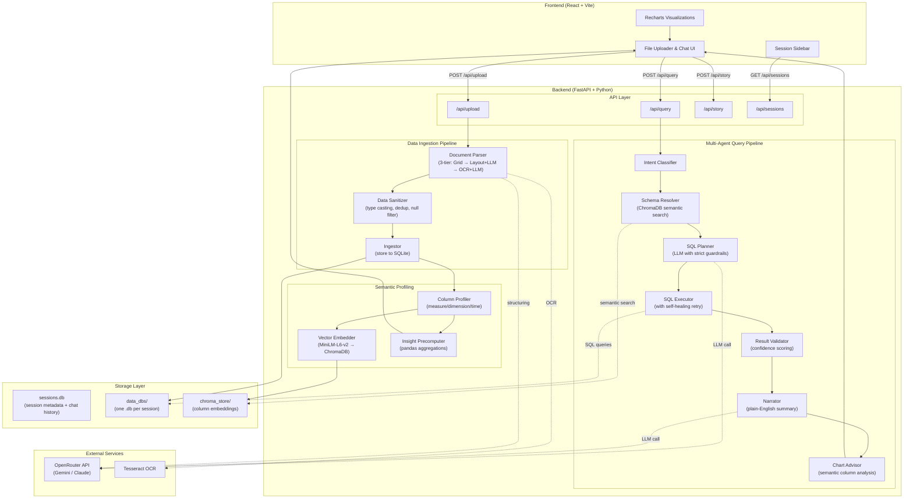

<div align="center">

# 🔍 DataLens — AI-Powered Conversational Analytics Platform

**Transform raw documents into interactive insights through natural language.**

<!-- ═══════════════════════════════════════════════════════════════════════
     📸 HERO SCREENSHOT — Replace the placeholder below with your screenshot
     ═══════════════════════════════════════════════════════════════════════ -->


</div>

---

## 📖 Overview

**DataLens** is a full-stack, AI-powered analytics platform that lets users upload raw data files — including CSVs, Excel spreadsheets, PDFs, and images of financial documents — and instantly query them using plain English. It eliminates the need for manual data wrangling, SQL expertise, or BI tool configuration by combining a multi-agent LLM pipeline with automated data profiling and intelligent chart generation.

**The problem it solves:** Extracting insights from unstructured documents (e.g., scanned bank statements, invoices) traditionally requires hours of manual data entry, regex heuristics, and SQL scripting. DataLens automates the entire pipeline — from OCR extraction to structured storage to conversational querying — in seconds.

**Intended users:** Business analysts, financial controllers, operations managers, startup founders, and anyone who needs quick data-driven answers without writing code.

---

## ✨ Features

### Implemented and Working

- **Multi-format file ingestion** — Upload `.csv`, `.xlsx`, `.xls`, `.pdf`, `.png`, `.jpg`, and `.jpeg` files through the drag-and-drop UI.
- **Intelligent PDF/Image parsing with 3-tier fallback strategy:**
  - **Tier 1:** Native table grid extraction via `pdfplumber` for digitally-created PDFs.
  - **Tier 2:** Layout-preserving text extraction → LLM-powered structuring for non-grid documents.
  - **Tier 3:** High-resolution OCR (300 DPI) via `pytesseract` → LLM-powered structuring for scanned/photographed documents.
- **LLM-powered data structuring** — Raw text from PDFs/images is sent to an LLM (Gemini/Claude via OpenRouter) which returns clean, typed CSV with meaningful column headers (Date, Description, Debit, Credit, Balance, etc.), replacing the traditional brittle regex/heuristic approach.
- **Automated data sanitization pipeline** — Strips currency symbols, auto-casts numeric types, removes OCR artifacts, drops columns with >90% null values, removes duplicate rows, and filters out monotonically increasing ID columns.
- **Semantic column profiling** — Each column is automatically classified as `measure`, `dimension`, or `time` using statistical heuristics. An LLM generates plain-English descriptions for every column.
- **Vector-based schema search** — Column descriptions are embedded using `all-MiniLM-L6-v2` (Sentence Transformers) and stored in ChromaDB, enabling semantic search when the user asks a question to find the most relevant columns.
- **Multi-agent conversational SQL pipeline** — User questions are processed through a 7-stage directed acyclic graph (DAG): Intent Classification → Schema Resolution → SQL Planning → Sandboxed Execution → Validation → Narration → Chart Recommendation.
- **Self-healing SQL execution** — If the generated SQL fails, the executor automatically sends the error back to the LLM for correction, retrying up to 2 times before surfacing an error.
- **Context-aware chart recommendation** — The Chart Advisor semantically analyzes column names and data shapes to choose the most appropriate visualization: line charts for time-series data, pie charts for ≤6 categories, bar charts for comparisons, and tables for raw data.
- **Precomputed dashboard insights** — Instant KPI cards are generated the moment data is uploaded (no LLM call required): total by category, distribution breakdowns, averages, trend lines, and top-N tables.
- **AI-generated suggested questions** — After upload, the LLM generates 5 contextual starter questions based on the actual column profiles.
- **Session management with sidebar** — Multiple analysis sessions can be created, switched between, and revisited. Chat history is persisted per session.
- **Confidence scoring** — Every AI response includes a confidence level (High / Medium / Low) based on intent type and query execution success.
- **Rate limiting** — Backend API is protected with configurable per-minute rate limits via `slowapi`.

---

## 🏗️ System Architecture

### High-Level Architecture



### Document Ingestion Pipeline (Detail)


### Multi-Agent Query Pipeline (DAG)

```mermaid
flowchart LR
    A["💬 User Question"] --> B["Intent Classifier<br/><i>aggregation, comparison,<br/>breakdown, trend,<br/>anomaly, follow_up, general</i>"]
    B --> C["Schema Resolver<br/><i>Semantic search in ChromaDB<br/>for top-5 relevant columns</i>"]
    C --> D["SQL Planner<br/><i>LLM generates SQL + chart type<br/>with strict guardrails</i>"]
    D --> E["Executor<br/><i>Run SQL on sandboxed SQLite<br/>Self-heal on error (2 retries)</i>"]
    E --> F["Validator<br/><i>Check empty results,<br/>truncate >500 rows,<br/>assign confidence</i>"]
    F --> G["Narrator<br/><i>LLM writes plain-English<br/>summary of results</i>"]
    G --> H["Chart Advisor<br/><i>Semantic column analysis<br/>→ bar/line/pie/table/none</i>"]
    H --> I["📊 Response to Frontend"]
```



---

## 💻 Tech Stack

| Layer | Technology | Purpose |
|-------|-----------|---------|
| **Frontend Framework** | React 18 + TypeScript | Component-based UI with type safety |
| **Build Tool** | Vite 5 | Fast dev server with HMR |
| **Styling** | Tailwind CSS 3 | Utility-first responsive design |
| **Charting** | Recharts 2 | Composable Bar, Line, Pie, and Table charts |
| **HTTP Client** | Axios | API communication with upload progress tracking |
| **Routing** | React Router DOM 6 | Client-side navigation |
| **Backend Framework** | FastAPI 0.111 | Async Python API with auto-generated OpenAPI docs |
| **ASGI Server** | Uvicorn 0.29 | Production-grade async server |
| **Data Processing** | Pandas 2.2 | DataFrame manipulation, type casting, aggregation |
| **SQL ORM** | SQLAlchemy 2.0 | Database engine creation and schema inspection |
| **Database** | SQLite | Session-isolated data storage (one `.db` per upload) |
| **PDF Parsing** | pdfplumber 0.11 | Native table grid extraction and layout-preserving text |
| **OCR Engine** | pytesseract 0.3 + Tesseract 5 | Optical character recognition for scanned documents |
| **Image Processing** | Pillow (PIL) | Image loading for OCR pipeline |
| **LLM Orchestration** | LangChain 0.2 | Prompt templates, chain composition, LLM wrappers |
| **LLM Provider** | OpenRouter → Gemini / Claude | Natural language understanding, SQL generation, narration |
| **Vector Database** | ChromaDB 0.5 | Persistent vector store for semantic column search |
| **Embeddings** | Sentence Transformers (`all-MiniLM-L6-v2`) | Column description embeddings for semantic matching |
| **Validation** | Pydantic 2.7 | Request/response schema validation |
| **Rate Limiting** | slowapi 0.1 | Per-IP rate limiting on API endpoints |
| **Testing** | pytest 8.2 | Unit tests with mocked LLM calls |

---

## 🚀 Installation & Run Instructions

### Prerequisites

| Tool | Version | Installation |
|------|---------|-------------|
| **Python** | 3.9+ | [python.org](https://www.python.org/downloads/) |
| **Node.js** | 18+ | [nodejs.org](https://nodejs.org/) |
| **Tesseract OCR** | 5.x | `brew install tesseract` (macOS) or `sudo apt install tesseract-ocr` (Ubuntu) |
| **OpenRouter API Key** | — | [openrouter.ai](https://openrouter.ai/) (free tier available) |

### Step 1: Clone the Repository

```bash
git clone https://github.com/yourusername/datalens.git
cd datalens
```

### Step 2: Backend Setup

```bash
cd backend

# Create and activate virtual environment
python3 -m venv venv
source venv/bin/activate        # macOS/Linux
# .\venv\Scripts\activate       # Windows

# Install Python dependencies
pip install -r requirements.txt

# Configure environment variables
cp .env.example .env
```

Open `backend/.env` and set your API key:

```env
# Required — get your key from https://openrouter.ai/
OPENROUTER_API_KEY=sk-or-v1-your-key-here
OPENROUTER_MODEL=google/gemini-2.5-flash

# Database paths (defaults work out of the box)
SESSIONS_DB_PATH=./sessions.db
DATA_DB_DIR=./data_dbs/
CHROMA_PATH=./chroma_store/

# Server
ALLOWED_ORIGIN=http://localhost:5173
PORT=8000

# LLM tuning
SQL_LLM_TEMPERATURE=0.1
NARRATOR_LLM_TEMPERATURE=0.3
MAX_RETRY_ATTEMPTS=2
MAX_RESULT_ROWS=500
MAX_UPLOAD_SIZE_MB=20
RATE_LIMIT_PER_MINUTE=30
```

### Step 3: Frontend Setup

Open a **new terminal**:

```bash
cd frontend

# Install Node dependencies
npm install

# Configure environment
cp .env.example .env
```

The frontend `.env` should contain:
```env
VITE_API_URL=http://localhost:8000
```

### Step 4: Launch the Application

**Terminal 1 — Backend:**
```bash
cd backend
source venv/bin/activate
uvicorn src.main:app --reload --port 8000
```

Verify the backend is running:
```bash
curl http://localhost:8000/health
# Expected: {"status":"ok"}
```

**Terminal 2 — Frontend:**
```bash
cd frontend
npm run dev
```

Open your browser at **http://localhost:5173**

### Quick Setup (Alternative)

A convenience script is provided:
```bash
chmod +x scripts/setup.sh
./scripts/setup.sh
```

---

## 🎯 Usage Examples

### Use Case 1: Upload a CSV and Chat

1. Open DataLens at `http://localhost:5173`.
2. Drag and drop a CSV file (e.g., sales data, transaction log) into the upload zone.
3. The system will automatically profile every column, generate insight cards, and suggest questions.
4. In the chat, type: _"What is the total revenue by region?"_
5. DataLens will generate SQL, execute it, and render a bar chart with a plain-English summary.

<!-- ═══════════════════════════════════════════════════════════════════════
     📸 SCREENSHOT — Upload & Dashboard view
     Replace the path below with your actual screenshot
     ═══════════════════════════════════════════════════════════════════════ -->


### Use Case 2: Upload a PDF Bank Statement

1. Upload a PDF bank statement (even a scanned image within a PDF).
2. The 3-tier parser will detect the best extraction strategy.
3. The LLM structures the raw text into clean columns: Date, Description, Debit, Credit, Balance.
4. Browse the precomputed insight cards or ask: _"What were my top 5 expenses?"_

<!-- ═══════════════════════════════════════════════════════════════════════
     📸 SCREENSHOT — PDF upload flow
     ═══════════════════════════════════════════════════════════════════════ -->


### Use Case 3: Conversational Drill-Down

1. Ask: _"Show spending by category"_ → Get a pie chart.
2. Follow up: _"Which category has the highest average amount?"_ → Get a bar chart.
3. Follow up: _"What is the trend of expenses over time?"_ → Get a line chart.

Each response includes the generated SQL, a confidence score, and a context-aware chart.

<!-- ═══════════════════════════════════════════════════════════════════════
     📸 SCREENSHOT — Chat conversation with charts
     ═══════════════════════════════════════════════════════════════════════ -->


### Use Case 4: AI-Generated Insight Cards

Click **"Generate AI Insights"** to produce precomputed dashboard cards based purely on the data — no prompt required.

<!-- ═══════════════════════════════════════════════════════════════════════
     📸 SCREENSHOT — AI Insight cards panel
     ═══════════════════════════════════════════════════════════════════════ -->


### Example API Calls

**Upload a file:**
```bash
curl -X POST http://localhost:8000/api/upload \
  -F "file=@/path/to/bank_statement.pdf;type=application/pdf"
```

**Query your data:**
```bash
curl -X POST http://localhost:8000/api/query \
  -H "Content-Type: application/json" \
  -d '{"session_id": "YOUR_SESSION_ID", "question": "What is the total debit amount?"}'
```

**Sample response:**
```json
{
  "answer": "The total debit amount across all transactions is 14,250.75.",
  "sql": "SELECT SUM(debit) AS total_debit FROM data_abc123",
  "chart_type": "none",
  "chart_data": [{"total_debit": 14250.75}],
  "confidence": "High",
  "columns_used": ["debit"],
  "intent": "aggregation"
}
```

**Generate AI insight cards:**
```bash
curl -X POST http://localhost:8000/api/story \
  -H "Content-Type: application/json" \
  -d '{"session_id": "YOUR_SESSION_ID"}'
```

**List all sessions:**
```bash
curl http://localhost:8000/api/sessions
```

---

## 📂 Folder Structure

```
DATALENS/
├── README.md                          # This file
├── .gitignore
│
├── backend/
│   ├── .env.example                   # Environment variable template (no secrets)
│   ├── requirements.txt               # Python dependencies (pip install -r)
│   ├── sessions.db                    # SQLite: session metadata + chat history
│   ├── data_dbs/                      # One .db file per upload session
│   ├── chroma_store/                  # ChromaDB persistent vector store
│   │
│   ├── src/
│   │   ├── main.py                    # FastAPI app entrypoint, CORS, rate limiting
│   │   │
│   │   ├── api/
│   │   │   ├── models.py             # Pydantic request/response schemas
│   │   │   └── routes/
│   │   │       ├── upload.py          # POST /api/upload — file ingestion endpoint
│   │   │       ├── query.py           # POST /api/query — conversational query endpoint
│   │   │       ├── story.py           # POST /api/story — AI insight card generation
│   │   │       └── sessions.py        # GET /api/sessions — session management
│   │   │
│   │   ├── data/
│   │   │   ├── ingestor.py            # File parsing orchestrator + SQLite storage
│   │   │   ├── document_parser.py     # 3-tier PDF/image parser (pdfplumber → LLM → OCR)
│   │   │   └── session_store.py       # Session CRUD + message persistence
│   │   │
│   │   ├── agents/
│   │   │   ├── intent_classifier.py   # LLM-based intent detection (7 categories)
│   │   │   ├── schema_resolver.py     # ChromaDB semantic column search
│   │   │   ├── sql_planner.py         # LLM → SQL generation with guardrails
│   │   │   ├── executor.py            # Sandboxed SQL execution with self-healing
│   │   │   ├── validator.py           # Result validation + confidence scoring
│   │   │   └── narrator.py            # LLM → plain-English result narration
│   │   │
│   │   ├── semantic/
│   │   │   ├── profiler.py            # Column type inference + LLM metric dictionary
│   │   │   └── embedder.py            # Sentence Transformer embeddings → ChromaDB
│   │   │
│   │   ├── story/
│   │   │   ├── precompute.py          # Pandas-based insight card generation engine
│   │   │   └── analyst_mode.py        # Story mode orchestrator (SQLite → precompute)
│   │   │
│   │   └── utils/
│   │       ├── llm_factory.py         # LLM singleton factory (OpenRouter/Gemini/Claude)
│   │       ├── chart_advisor.py       # Semantic chart type recommendation
│   │       └── confidence.py          # Confidence level enum (High/Medium/Low)
│   │
│   └── tests/
│       ├── test_executor.py           # SQL execution + self-healing retry tests
│       ├── test_profiler.py           # Semantic type inference tests
│       └── test_sql_planner.py        # SQL generation structure + injection guard tests
│
├── frontend/
│   ├── .env.example                   # Frontend environment template
│   ├── package.json                   # Node dependencies
│   ├── vite.config.ts                 # Vite build configuration
│   ├── tailwind.config.js             # Tailwind CSS theme + custom colors
│   ├── tsconfig.json                  # TypeScript configuration
│   │
│   └── src/
│       ├── App.tsx                    # Root component — layout, routing, state orchestration
│       ├── main.tsx                   # React DOM entry point
│       ├── index.css                  # Global styles + Tailwind imports
│       │
│       ├── components/
│       │   ├── Upload/
│       │   │   ├── FileUploader.tsx   # Drag-and-drop file upload with progress bar
│       │   │   └── DatasetSummary.tsx # Dataset metadata display after upload
│       │   ├── Chat/
│       │   │   ├── ChatWindow.tsx     # Chat container with suggested questions
│       │   │   ├── ChatInput.tsx      # Message input bar
│       │   │   ├── ChatMessage.tsx    # Individual message bubble (user/assistant)
│       │   │   └── SuggestedQuestions.tsx
│       │   ├── Charts/
│       │   │   ├── ChartRenderer.tsx  # Dynamic chart rendering (bar/line/pie/table)
│       │   │   └── MiniChart.tsx      # Compact chart for insight cards
│       │   ├── Story/
│       │   │   ├── StoryCards.tsx      # Insight card grid container
│       │   │   └── StoryCard.tsx      # Individual insight card with drill-in
│       │   ├── Layout/
│       │   │   └── Sidebar.tsx        # Session navigator sidebar
│       │   └── Audit/
│       │       └── AuditPanel.tsx     # SQL audit trail viewer
│       │
│       ├── hooks/
│       │   ├── useSession.ts          # Upload, session switching, metadata state
│       │   ├── useChat.ts             # Chat message state + API calls
│       │   └── useStory.ts            # Insight card generation state
│       │
│       ├── services/
│       │   └── api.ts                 # Axios instance pointing to backend
│       │
│       └── types/
│           └── index.ts               # TypeScript interfaces (DatasetMeta, Message, StoryCard)
│
├── docs/
│   ├── architecture.md                # Architecture overview
│   └── screenshots/                   # 📸 Place your screenshots here
│
└── scripts/
    └── setup.sh                       # One-command project setup
```

---

## ⚙️ Configuration Files

### Backend: `backend/.env.example`

All configuration is driven through environment variables. No secrets are committed to the repository.

| Variable | Default | Description |
|----------|---------|-------------|
| `OPENROUTER_API_KEY` | *(required)* | API key for LLM access via OpenRouter |
| `OPENROUTER_MODEL` | `google/gemini-2.5-flash` | LLM model identifier |
| `SESSIONS_DB_PATH` | `./sessions.db` | Path to session metadata database |
| `DATA_DB_DIR` | `./data_dbs/` | Directory for per-session data databases |
| `CHROMA_PATH` | `./chroma_store/` | ChromaDB persistent storage path |
| `ALLOWED_ORIGIN` | `http://localhost:5173` | CORS allowed origin |
| `SQL_LLM_TEMPERATURE` | `0.1` | Temperature for SQL generation (low = precise) |
| `NARRATOR_LLM_TEMPERATURE` | `0.3` | Temperature for narration (slightly creative) |
| `MAX_RETRY_ATTEMPTS` | `2` | Self-healing SQL retry count |
| `MAX_RESULT_ROWS` | `500` | Maximum rows returned per query |
| `MAX_UPLOAD_SIZE_MB` | `20` | Maximum upload file size |
| `RATE_LIMIT_PER_MINUTE` | `30` | API rate limit per IP |

### Frontend: `frontend/.env.example`

| Variable | Default | Description |
|----------|---------|-------------|
| `VITE_API_URL` | `http://localhost:8000` | Backend API base URL |

---

## 🧪 Testing

Tests are located in `backend/tests/` and use **pytest** with mocked LLM calls to avoid API costs during testing.

### Running Tests

```bash
cd backend
source venv/bin/activate
pytest tests/ -v
```

### Test Coverage

| Test File | What It Tests |
|-----------|--------------|
| `test_executor.py` | SQL execution against a real SQLite DB, verifying success paths and self-healing retry logic (LLM fixes broken SQL) |
| `test_profiler.py` | Semantic type inference — ensures numeric columns → measure, string columns → dimension, datetime columns → time |
| `test_sql_planner.py` | SQL planner output structure (valid QueryPlan with reasoning, sql, chart_type) and prompt injection resistance (DROP TABLE blocked) |

---

## 🔬 Technical Deep-Dive

### Why LLM-as-a-Parser?

Traditional PDF parsing relies on regex patterns and whitespace splitting, which produces garbage columns like `["Statement", "1", "of", "Page"]` from non-grid documents. Our approach sends the raw extracted text to an LLM with strict instructions:

```
"You are a data extraction expert. Identify ALL tabular data. Return as valid CSV 
with meaningful column names (Date, Description, Debit, Credit, Balance). 
Clean up OCR artifacts. Remove currency symbols. Use YYYY-MM-DD for dates. 
Output ONLY CSV. No explanation."
```

This consistently produces clean, structured output like:

```csv
Date,Description,Debit,Credit,Balance
2024-01-15,SALARY CREDIT,,5000.00,15000.00
2024-01-16,ATM WITHDRAWAL,200.00,,14800.00
2024-01-20,GROCERY STORE,85.50,,14714.50
```

### Why Semantic Search for Schema Resolution?

When a user asks _"What were my biggest expenses?"_, the system needs to know which columns map to "expenses." Instead of keyword matching, we embed all column descriptions using `all-MiniLM-L6-v2` and store them in ChromaDB. At query time, we embed the question and find the top-5 semantically similar columns. This means:
- "expenses" matches `debit` (description: "Amount debited from account")
- "income" matches `credit` (description: "Amount credited to account")
- "when did I spend" matches `date` (description: "Transaction date")

### Why Session-Isolated SQLite?

Each upload creates a separate `.db` file in `data_dbs/`. This provides:
- **Security isolation** — One user's data cannot accidentally leak to another session's queries.
- **Zero-config storage** — No external database server required.
- **Easy cleanup** — Deleting a session removes its `.db` file entirely.

---

## ⚠️ Known Limitations

- **Document text truncation:** The LLM-based document structuring currently truncates input text to 6,000 characters to stay within context window limits. Very long multi-page documents (50+ pages) may lose tail-end data. A sliding-window chunking strategy is planned.
- **No user authentication:** The application runs in an ephemeral session mode. There are no user accounts, login flows, or persistent cross-session profiles. Session data persists locally via SQLite but is not tied to authenticated users.
- **Local SQLite scaling:** The per-session SQLite architecture is optimized for individual-scale analytical workloads (up to several hundred thousand rows). It is not designed for multi-terabyte enterprise data warehouse use cases.
- **OCR accuracy on handwriting:** Tesseract OCR performs well on printed text but may struggle with handwritten notes or very low-resolution scans.
- **LLM latency on upload:** PDF uploads involving Tier 2 or Tier 3 parsing require an LLM API call, which adds 3–10 seconds of processing time depending on document length and API response speed.

---

## 🔭 Future Improvements

- **Sliding-window document chunking** — Process 500+ page financial reports by overlapping context windows and stitching extracted tables into a single DataFrame.
- **Cloud database connectors** — Swap the SQLite dialect for Snowflake, BigQuery, or PostgreSQL connectors to enable enterprise-scale data analysis.
- **User authentication** — Integrate OAuth/NextAuth to enable persistent user profiles, saved dashboards, and shared workspaces.
- **Streaming responses** — Use Server-Sent Events (SSE) to stream LLM narration token-by-token for a more responsive chat UX.
- **Export functionality** — Allow users to export generated charts as PNG/SVG and query results as CSV.
- **Cloud OCR fallback** — Integrate AWS Textract or Google Document AI as a high-accuracy fallback for Tesseract on complex document layouts.

---

## 📸 Screenshots

> **Note:** Replace the placeholder images above with your actual screenshots. Place image files in `docs/screenshots/` and reference them using relative paths.

Create the screenshots directory:
```bash
mkdir -p docs/screenshots
```

Suggested screenshots to capture:
1. **`hero_dashboard.png`** — The main DataLens interface after a file upload
2. **`upload_dashboard.png`** — The upload zone + dashboard transition
3. **`pdf_upload.png`** — A PDF bank statement being processed
4. **`chat_query.png`** — A chat conversation showing natural language query → SQL → chart
5. **`insight_cards.png`** — The AI Insights panel with precomputed cards

---
